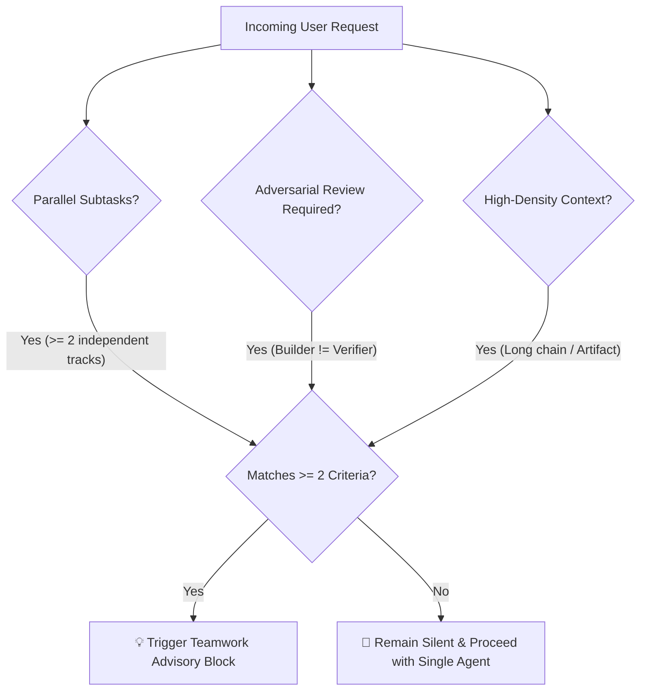

# 🤝 Antigravity Teamwork Advisor

[](LICENSE)
[]()
[-purple.svg)]()
[]()

> **An autonomous governance protocol that turns your AI Agent into a proactive "Teamwork Architecture Advisor".**
> It dynamically evaluates task complexity, predicts when multi-agent collaboration (`/teamwork-preview`) outperforms single-agent iteration, recommends the optimal Gemini reasoning tier (High / Medium / Low), and generates turnkey prompts for instant dispatch.

[🇨🇳 简体中文文档 (Chinese Version)](README_zh.md) | [📖 Instructions for AI Agents](AGENTS.md)

---

## ⚡ The Quick Start: Drop to Your Agent

You do not need to configure this manually. **Simply send this repository URL (or path) to your AI Agent** (in Google Antigravity, Claude Code, Cursor, etc.) and say:

> *"Please read this repository and equip yourself with this capability."*

Your Agent will read [`AGENTS.md`](AGENTS.md), auto-detect its configuration environment, and install the protocol non-destructively!

---

## 💡 Motivation: The "When to Teamwork" Dilemma

In modern agentic IDEs like **Google Antigravity**, users frequently face a common puzzle:

> *"I know `/teamwork-preview` exists, but when should I actually use it? Should I just use the normal single-agent chat? And if I do use Teamwork, which Gemini model tier should I select — 3.8 Flash High, Medium, or Low?"*

Using Teamwork for simple bug fixes creates unnecessary multi-agent overhead. Conversely, using a single agent for a multi-module full-stack system leads to context bloat, memory degradation, and missed edge cases.

**Antigravity Teamwork Advisor** solves this once and for all:
- **Zero-Friction Detection**: The Agent monitors incoming task complexity in the background.
- **Selective Activation**: Recommends multi-agent collaboration only when tasks cross the threshold.
- **Instant Dispatch**: Generates a turnkey prompt and specifies the reasoning tier (High / Medium / Low).
- **Silent by Default**: Remains completely silent during ordinary conversation, bug fixes, and quick queries.

---

## 📐 The 3-Pillar Decision Framework

The Agent triggers a Teamwork recommendation **if and only if** at least two of the following conditions are met:



1. **Parallel Subtasks**: The task naturally splits into $\ge 2$ independent, concurrent workstreams (e.g. frontend UI + backend API + database migrations; or parallel analysis across multiple codebases/papers).
2. **Adversarial Review & Cross-Verification**: The task demands independent verification (e.g. builder vs auditor, formal math checking, browser automated regression testing).
3. **High-Density Delivery & Long Chain**: Large-scale deliverables (interactive academic slide decks, end-to-end benchmark platforms) where a single agent would suffer from context bloat.

---

## 🧠 Gemini Reasoning Tier Matrix

Teamwork requires different degrees of reasoning depth depending on the nature of the task:

| Model Tier | Primary Use Cases | Key Advantage in Teamwork |
| :--- | :--- | :--- |
| **Gemini 3.8 Flash (High) / Pro** | Mathematical theory, CCF-A research narratives, foundation architecture design, security & adversarial auditing | Deep chain-of-thought reasoning; eliminates latent architectural bugs and hallucinations |
| **Gemini 3.8 Flash (Medium)** *(Default)* | Full-stack features, multi-component refactoring, interactive HTML artifacts, standard unit test suites | Ideal balance of reasoning depth, velocity, and token throughput for smooth team concurrency |
| **Gemini 3.8 Flash (Low / Lite)** | Mechanical batch processing, 50+ dataset preprocessing, format conversions, repetitive migrations | Ultra-high concurrency throughput, low cost, minimal latency for worker-level execution |

---

## 📋 What the User Experiences (Standard Advisory Block)

When triggered, the Agent places a structured advisory card at the very top of its response:

> 💡 **Recommended: Multi-Agent Collaboration (`/teamwork-preview`)**
> 
> - **Rationale**: This task decomposes into 3 independent tracks (Hybrid Retrieval Engine + Frontend UI Workbench + Automated E2E Regression QA). Parallel execution prevents single-agent context exhaustion.
> - **Recommended Model Tier**: **Gemini 3.8 Flash (High)** — High reasoning depth required for vector index formulation, ranking algorithms, and state synchronization.
> - **Turnkey Prompt** (Copy the block below, type `/teamwork-preview` in chat, and paste):
> 
> ```text
> Goal: Build an enterprise-grade RAG studio with hybrid search, interactive dashboard, and automated test suite.
> Team Roles:
>   - Backend Architect: Implement vector index, BM25 hybrid search, and ranking engine
>   - Frontend Engineer: Build responsive interactive dashboard workbench
>   - QA Verifier: Execute headless browser automated regression tests for API & UI workflows
> Environment Constraints: Confine all outputs to isolated directory
> Acceptance Criteria:
>   - [ ] Backend hybrid retrieval pipeline passes unit and benchmark tests
>   - [ ] Frontend dashboard loads and displays search metrics in real time
>   - [ ] Automated browser tests pass with 0 console errors
> ```

---

## 📦 Manual Installation

If you prefer to install it yourself without delegating to an Agent:

```bash
# Clone the repository
git clone https://github.com/CheeseBoo/antigravity-teamwork-advisor.git
cd antigravity-teamwork-advisor

# Run the automated installer (defaults to ~/.gemini/config/AGENTS.md)
bash install.sh --lang en

# Or specify a custom target path:
bash install.sh --lang en --target ~/.gemini/config/rules/teamwork-advisor.md
```

---

## 🌐 Cross-Agent Adaptation

While crafted natively for **Google Antigravity** (`/teamwork-preview`), the underlying protocol is fully model-agnostic and platform-agnostic:

* **Claude Code / Anthropic**: Map `/teamwork-preview` to Claude's Subagent / Task dispatch system; map High $\to$ Claude 3.7 Sonnet (Thinking), Medium $\to$ Claude 3.5 Sonnet, Low $\to$ Claude 3.5 Haiku.
* **Cursor / Windsurf**: Inject into `.cursorrules` or `.windsurfrules` to guide Composer / Cascade when handling complex multi-step architectures.
* **OpenAI Swarm / AutoGen / CrewAI**: Use the protocol as a high-level triage layer before launching dynamic agent swarms.

---

## 📄 License

Distributed under the [MIT License](LICENSE). Maintained by [CheeseBoo](https://github.com/CheeseBoo) and community contributors.
