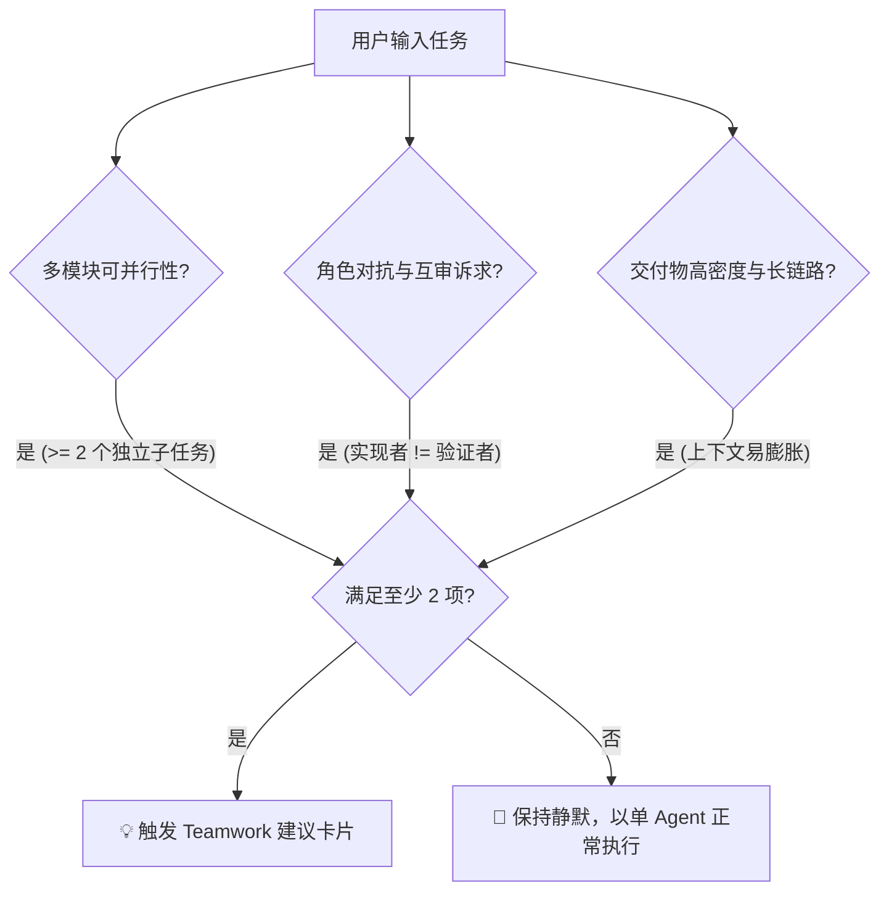

# 🤝 Antigravity Teamwork Advisor (多智能体编队自动建议机制)

[](LICENSE)
[]()
[-purple.svg)]()
[]()

> **一套开源的 AI Agent 自治治理契约与提示词路由协议。**
> 赋予 AI 编程助手主动充当“编队架构顾问”的能力：在日常对话中动态评估任务复杂度，自动判断何时应由单 Agent 切换为多 Agent 协同 (`/teamwork-preview`)，精准推荐 Gemini 推理层级（High / Medium / Low），并一键生成即插即用的编队启动 Prompt。

[English Documentation](README.md) | [📖 Instructions for AI Agents (Agent 自治配置)](AGENTS.md)

---

## ⚡ 极简上手：直接把本仓库甩给你的 Agent

你无需手动编辑任何配置文件。**只需将本仓库的 GitHub 链接（或本地路径）直接发给你的 AI Agent**（无论是 Google Antigravity、Claude Code 还是 Cursor）：

> *“请阅读这个仓库，并为自己配置上这个能力。”*

Agent 将自动读取 [`AGENTS.md`](AGENTS.md)，识别宿主环境（如 `~/.gemini/config/AGENTS.md`），并通过无损注入脚本完成自闭环安装！

---

## 💡 诞生背景：什么时候该用 Teamwork 的困惑？

在 **Google Antigravity** 及现代多 Agent 开发环境中，开发者经常面临一个普遍痛点：

> *“我知道 Antigravity 有 `/teamwork-preview` 这个多智能体协同功能，但我平时对话时不知道什么时候该用它？是继续用当前单 Agent 聊，还是开 Teamwork？如果用 Teamwork，该选 Gemini 3.8 Flash High、Medium 还是 Low？”*

* **滥用 Teamwork 的代价**：修一个简单 Bug 或单文件微调时开 Teamwork，会带来多余的子 Agent 拆分与通信开销；
* **不用 Teamwork 的代价**：面对全栈跨端、大系统重构或带自动化审查的大任务时，单 Agent 极易发生上下文过载（Context Bloat）、注意力衰减或顾此失彼。

**Antigravity Teamwork Advisor** 完美化解了这一矛盾：
* **后台静默感知**：日常对话、单点微调、简单问答时，Agent 严格保持静默，绝不滥发推荐；
* **精准触发建议**：当任务满足“多模块并行”、“红蓝对抗审查”或“高密度长链路”时，主动输出结构化建议卡片；
* **选型与提示词一键交付**：明确指出应该用 Gemini 3.8 Flash High、Medium 还是 Low，并附带开箱即用的结构化 Prompt。

---

## 📐 触发判定三要素 (The 3-Pillar Decision Framework)

Agent 采用严格的触发函数，**当且仅当满足以下 3 项准则中的至少 2 项时**才会触发建议：



1. **多模块可并行性 (Parallel Subtasks)**：任务自然拆分为 2 个以上可并行开发或调研的独立子任务（如前后端并行、多组件解耦重构、多篇文献横向对比、多数据集并发清洗）；
2. **角色对抗与互审诉求 (Adversarial Review)**：任务不仅要编写代码，还需要独立的审查员（Auditor）、测试验证员（Verifier）进行交叉验收（如严苛的数学公式推导、学术叙事一致性审查、浏览器自动化回归测试）；
3. **交付物高密度与长链路 (High-Density Delivery)**：如独立交互式学术演示工件、大型端到端基准测试体系搭建等，单 Agent 容易超出有效上下文容量。

---

## 🧠 Gemini 模型推理层级选型矩阵

在 Teamwork 模式下，不同推理层级的算力分配与分工策略：

| 模型层级 | 核心应用场景 | Teamwork 中的独特优势 |
| :--- | :--- | :--- |
| **Gemini 3.8 Flash (High) / Pro** | 复杂数学推导、CCF-A 论文 Narrative 对齐、底层核心架构设计、安全性与一致性深度审计、红蓝对抗审查 | 具备长思维链深度推理（Deep Reasoning），能够准确把握大型复杂系统的上下文，消除隐性逻辑漏洞 |
| **Gemini 3.8 Flash (Medium)** *(默认推荐)* | 标准全栈功能落地、多文件协同重构、交互式 HTML / 演示工件制作、常规单测与功能验证 | 速度、推理深度与 Token 吞吐的极佳平衡点，团队并发协作敏捷高效，不产生多余迟滞 |
| **Gemini 3.8 Flash (Low / Lite)** | 大规模机械化批处理、文件格式批量转换、50+ 数据集预处理与清洗、重复性代码模板替换 | 极高并发吞吐、极低延迟与成本，适合充当编队里只管执行单一机械指令的 Worker |

---

## 📋 实际交互呈现效果 (标准建议块)

当触发准则命中时，Agent 会在回复的最上方提供醒目的卡片：

> 💡 **建议使用 Teamwork 编队协同 (`/teamwork-preview`)**
> 
> - **推荐理由**：当前任务包含核心混合检索算法引擎、响应式前端看板与全链路无头浏览器端到端测试 3 个可并行模块，且要求严格的“编写 $\leftrightarrow$ 审查”对抗校验，多 Agent 编队可显著防范单 Agent 上下文臃肿与注意力遗忘。
> - **建议模型层级**：**Gemini 3.8 Flash (High)** — 涉及向量索引构建、混合重排算法与复杂跨组件状态同步，需高推理深度确保无架构漏洞。
> - **即插即用 Prompt**（复制以下内容，在输入框中输入 `/teamwork-preview` 并粘贴即可启动）：
> 
> ```text
> 目标：构建企业级轻量化 RAG 检索增强平台（含混合检索引擎、响应式看板与自动化测试套件）。
> 角色分工：
>   - Backend Architect: 负责向量索引、BM25 混合重排算法引擎与检索 API 实现
>   - Frontend Engineer: 负责响应式前端可视化工作台与实时交互看板
>   - QA Verifier: 编写并执行自动化端到端测试脚本，验证检索指标与全流程 UI 交互
> 环境安全约束：严格在指定输出目录下生成静态产物，严禁破坏性操作
> 验收标准：
>   - [ ] 后端混合检索链路通过基准检索与单测
>   - [ ] 前端看板秒级加载并实时呈现指标变化
>   - [ ] 自动化测试脚本验证 0 报错且全链路测试通过
> ```

---

## 📦 手动安装与集成指南

如果你希望由自己手动配置：

```bash
# 1. 克隆仓库
git clone https://github.com/CheeseBoo/antigravity-teamwork-advisor.git
cd antigravity-teamwork-advisor

# 2. 执行自动化安装脚本（默认注入 ~/.gemini/config/AGENTS.md）
bash install.sh --lang zh

# 或指定自定义注入目标：
bash install.sh --lang zh --target ~/.gemini/config/rules/teamwork-advisor.md
```

安装脚本具有**幂等保护**与**自动备份机制**：若检测到配置已存在则自动跳过，修改前会自动生成带时间戳的 `.bak` 备份文件。

---

## 🌐 跨平台与跨 Agent 适配

本机制以 **Google Antigravity** 与 **Gemini 3.8 模型** 为第一优先级原生设计，但其背后的编队架构理念完全可跨平台迁移：

* **Claude Code (Anthropic)**：将 `/teamwork-preview` 映射为 Claude 的 Subagent / Task 机制；模型映射为 High $\to$ Claude 3.7 Sonnet (Thinking)、Medium $\to$ Claude 3.5 Sonnet、Low $\to$ Claude 3.5 Haiku。
* **Cursor / Windsurf**：将规则注入 `.cursorrules` 或 `.windsurfrules`，引导 Composer / Cascade 在面对复合任务时先做多角色架构规划。
* **OpenAI Swarm / AutoGen / CrewAI**：作为主调度器（Router）在接收用户请求时的前置分类与分派协议。

---

## 📄 开源许可证

本项目基于 [MIT License](LICENSE) 开源。由 [CheeseBoo](https://github.com/CheeseBoo) 与开源社区共同维护。欢迎提交 Issue 与 PR 共同完善多智能体治理规范！
